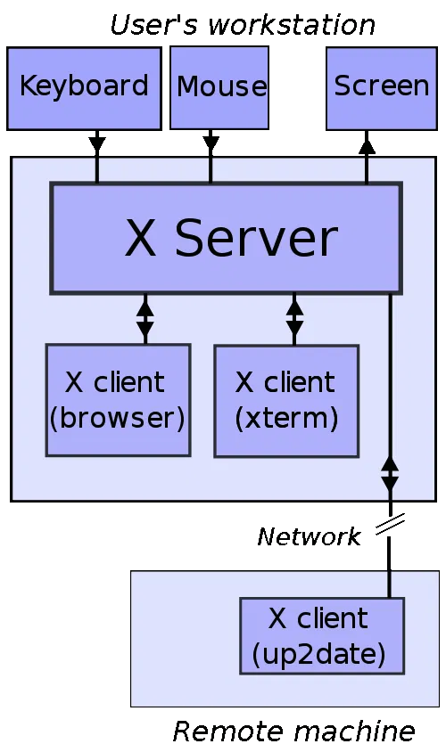
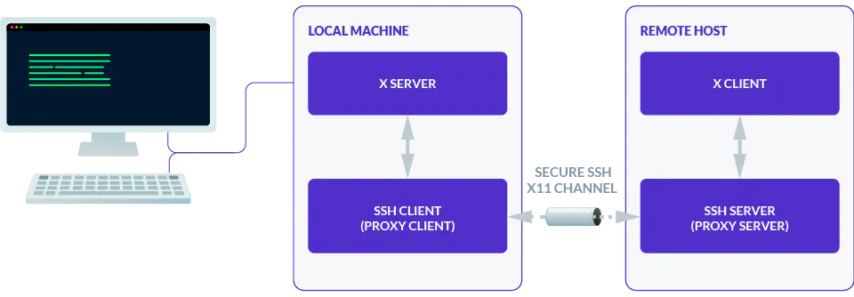
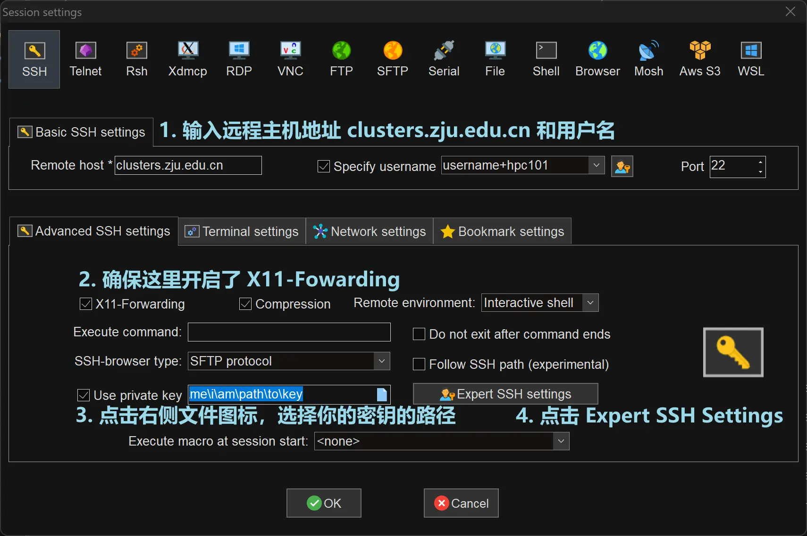
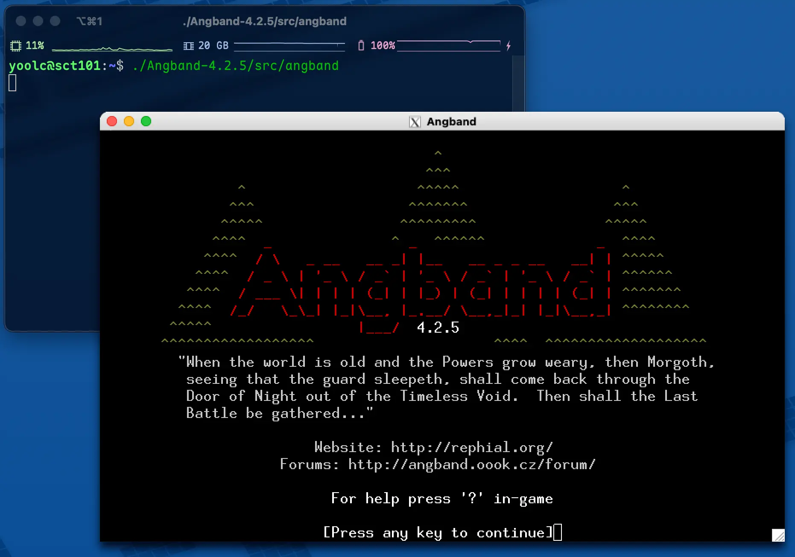

# 登陆节点

我们需要通过登录节点进入集群，集群的计算节点不能直接访问，只能通过登录节点进行连接。同时，登录节点也不适合运行任何计算任务。

目前开放的登陆节点是一台虚拟机，配置如下：

- 节点名: `hpc101`
- CPU: Intel(R) Xeon(R) Platinum 8358 CPU @ 2.60GHz 128 线程
- 内存: 256GB
- 每位同学家目录配额 50GB

!!! warning "重要使用须知"

    - 集群为全体学员共享平台，请共同维护高效运行环境，严禁资源滥用。若发现异常占用（如恶意脚本、持续满负荷任务），将追溯责任人并限制账户。

    - 集群网络资源有限，严禁进行非授权的网络活动。

    - 请勿存放与课程无关的大文件（如影视、游戏、个人备份等）。

    - 重要数据及时本地备份。

# 登录集群

## 配置 SSH 密钥登录

集群仅会支持 SSH 密钥登录。请按照以下步骤配置 SSH 密钥登录：

1. 在 [ZJU Git](https://git.zju.edu.cn/) 中添加你的 SSH 公钥。集群 SSH 验证将从这里动态获取你的公钥。你可以通过 `https://git.zju.edu.cn/学号.keys` 查看你添加的公钥。如果没有配置过 SSH 密钥对，请参考 [Lab 0 Linux Crash Course](../lab/Lab0-LinuxCrashCourse/index.md) 中的配置方法。
1. 登录集群时，使用 `ssh 账户名+节点名@clusters.zju.edu.cn` 登录。如果你的 SSH 密钥配置正确，你将登录到集群登录节点。**账户名为 h+学号**。

    !!! example

        学号 3260100000 的用户名为 `h3260100000`

        用户 `h3260100000` 登录到 `hpc101` 节点，应当执行的命令为：

        ```shell
        ssh h3260100000+hpc101@clusters.zju.edu.cn
        ```
    
    !!! warning "警告"
        如果这一步你看到了输入密码的提示，说明 SSH 密钥登录配置有误，需要重新检查。
        
        **请不要在登录集群时输入自己的密码**，这是因为登录节点配置了蜜罐，输入的密码会被明文记录在日志中。

1. `clusters.zju.edu.cn` 支持 SSH 的端口有：22、80、443。如果默认端口（22）无法连接，请尝试使用另外两个端口：

    ```shell
    ssh username+nodename@clusters.zju.edu.cn -p 443
    ```

    受限于学校网络安全策略，目前已知下列情况下 22 端口无法使用，请使用 80 或 443 端口：

    - **校外访问** (注意放假后校外访问时需要更改端口)
    - RVPN（zju-connect）访问

1. 在集群内，要通过 SSH 连接到其他节点，不需要输入用户名，直接使用 `ssh nodename` 即可。

    !!! example

        在集群内的 `hpc101` 节点上 SSH 到 `hpc102` 节点：

        ```shell
        ssh hpc102
        ```

!!! tip

    如果使用终端命令行或者 Visual Studio Code 连接集群，可以通过配置 `ssh config` 来获得更加优雅的登陆方式。

    对于 Linux 和 macOS, 这一配置位于 `~/.ssh/config`，对于 Windows 则位于 `C:\Users\<用户名>\.ssh\config`
    
    例如：

    ```text title="~/.ssh/config"
    Host hpc101
        User h<学号>+hpc101
        HostName clusters.zju.edu.cn
        ForwardX11 yes
        Port 443
    ```

    此后可以使用

    ```shell
    ssh hpc101
    ```

    或在 Visual Studio Code 建立远程 SSH 连接时选择 `hpc101` 连接到集群


!!! warning

    登陆节点限制了每个用户最多使用8个CPU核心(800% CPU Time),和 12GB 内存。请不要在登陆节点上运行任何计算任务。


## 下一步：[提交作业](./job.md)

## Optional: 开启 X11 Forwarding

<!-- !!! quote

    - [What You Need to Know About X11 Forwarding - Teleport](https://goteleport.com/blog/x11-forwarding/)

!!! warning

    Termius 目前暂不支持 X11 Forwarding。 -->

在完成课程实验任务时，我们可能会需要使用一些图形化界面的程序，比如 Intel VTune Profiler。但这些软件安装在远程的计算节点上，我们如何在自己的电脑上使用这些图形化程序呢？这就需要通过 X11 Forwarding 来实现。

### 在系统上安装 X Server

我们可以使用 SSH 的 X11 Forwarding 功能，将远程服务器的图形界面显示到本地。

当然，这需要本地有 X Server (如果你对这背后的原因比较好奇，请阅读 “X11 Forwarding 原理”)，请阅读接下来的指导，在你的电脑上安装 X Server。

??? info "X11 Forwarding 原理"

    !!! info inline ""

        <figure markdown="span">
        <center>
        
        </center><figcaption>
        X 视窗系统架构
        <br /><small>
        [MakeTechEasier](https://www.maketecheasier.com/the-x-window-system/)
        </small> </figcaption>
        </figure>

    X 视窗系统（X Window System）是一种在 UNIX 和类 UNIX 操作系统上运行的图形用户界面系统。为了使多个程序共享一套硬件（如显示器、键盘和鼠标），它设计为服务器/客户端架构，如上图所示：

    - X Server：控制硬件，向客户端提供访问硬件的服务。
    - X Client：每当你启动一个图形界面（Graphical User Interface, GUI）应用程序时，它会有一个 X Client，负责与 X Server 交互，使画面显示在屏幕上。

    X 视窗系统的服务器/客户端通信协议可以通过网络传输，这就是 X11 Forwarding 的原理。

    <figure markdown="span">
    <center>
    { width=80% align=center }
    </center><figcaption>
    X11 Forwarding 原理
    <br /><small>
    [Teleport](https://goteleport.com/blog/x11-forwarding/)
    </small> </figcaption>
    </figure>


!!! note "安装 X Server"
    === "Windows"

        如果你在 Lab 0 时安装并配置了 WSL，[它自带 X Server](https://learn.microsoft.com/en-us/windows/wsl/tutorials/gui-apps)，使用 WSL 连接时无需安装额外工具。

        此外，推荐使用 MobaXTerm 来进行连接，具体配置如下:

        1. 创建新的 SSH Session，在设置里按照如下步骤配置:

            

        1. 在 Expert SSH Settings 中，选择协议版本为 SSHv2.

            
        
        1. 点击确认，随后便可在左侧侧边栏中找到 HPC101 的配置，双击进行连接。

        你也可以尝试下面的工具:

        - [Xming](http://www.straightrunning.com/XmingNotes/)
        - [vcxsrv](https://sourceforge.net/projects/vcxsrv/)
    
    === "macOS"

        推荐使用 [xQuartz](https://www.xquartz.org/)。

        ```bash
        brew install xquartz
        ```
    
    === "Linux"

        如果你的桌面环境使用的是 X11，那么无需进行任何额外配置。

        如果使用 Wayland 桌面环境，则可能需要安装并配置 XWayland, 请根据你的发行版进行配置。

### 使用 SSH X11 Forwarding


默认情况下，SSH 不会转发 X11 会话, 你只需要在连接到集群时使用的 SSH 命令上添加 `-X`，或在 SSH Config 中添加 `ForwardX11 yes` 即可启用 X11 转发。


### 测试 X11 Forwarding

为了测试 X11 Forwarding，也为了熟悉集群操作，推荐同学们在集群上编译 Lab 1 中的 Angband 游戏。

打开你编译好的 Angband，如果一切顺利，你会看到如下的界面:

```bash
user@local:~$ ssh -X user@remote
user@remote:~$ ./Angband-4.2.5/src/angband
```

<figure markdown="span">
  { width=80% align=center }
  <figcaption>
    X11 Forwarding 成功
  </figcaption>
</figure>

但如果你遇到了类似如下的错误:

```bash
user@local:~$ ssh user@remote
user@remote:~$ ./Angband-4.2.5/src/angband
./Angband-4.2.5/src/angband: Angband needs at least an 80x24 'curses' screen
```

这说明 X11 Forwarding 配置出现了问题，可能需要配置环境变量，如 `echo "export DISPLAY=:0" >> ~/.zprofile`，具体请根据产生的错误信息进行调整。

### 常见问题

请根据你的情况检查以下问题：

!!! question "是否能看到如下的 SSH Banner？"

    ```shell
    $ ssh username+nodename@clusters.zju.edu.cn
    * * * * * * * * * * * * * * * * * * * * * * * * * * *
    * ███████╗     ██╗██╗   ██╗███████╗ ██████╗████████╗*
    * ╚══███╔╝     ██║██║   ██║██╔════╝██╔════╝╚══██╔══╝*
    *   ███╔╝      ██║██║   ██║███████╗██║        ██║   *
    *  ███╔╝  ██   ██║██║   ██║╚════██║██║        ██║   *
    * ███████╗╚█████╔╝╚██████╔╝███████║╚██████╗   ██║   *
    * ╚══════╝ ╚════╝  ╚═════╝ ╚══════╝ ╚═════╝   ╚═╝   *
    * * * * * * * * * * * * * * * * * * * * * * * * * * *
    Mon, 01 Jul 2024 12:47:19 +0000
    Your IP: ***.***.***.***
    User: username
    %%% 我靠，桌子上怎么有水啊，显卡沾水了😱😱😱
    ```

    ??? note "不能看见 SSH Banner"

        未能连接到 `clusters.zju.edu.cn`。

        - 校网环境：检查 `clusters.zju.edu.cn` 是否解析到 `10.78.18.247`，检查 DNS 设置是否正确。
        - 校外环境：尝试 80 或 443 端口，检查防火墙设置。

        如果使用的是 MobaXTerm、XShell 等软件，需要在其选项里找到关于协商 ssh 版本的选项，并指定为 SSHv2
        
        - MobaXTerm: 在 SSH Session 设置中, `Expert SSH Settings` -> `SSH version` 中选择 `SSHv2`

            

    ??? note "能看见 SSH Banner"

        根据 SSH Banner 后的错误信息检查：

        | 错误信息 | 原因 |
        | --- | --- |
        | `username@clusters.zju.edu.cn: Permission denied (publickey).` | 用户名或 SSH 密钥未配置正确 |
        | `Connection closed by ***.***.***.*** port ***` | 内部错误，请联系管理员 |
        | `* Unknown host "nodename"` | 目标节点不存在，请检查节点名称<br />若未添加节点名称，则默认节点不在线，请联系管理员 |
        | `Failed to connect to remote host`<br>`no route to host`<br>`i/o timeout` | 目标节点不在线，请联系管理员 |

### 集群 SSH 代理原理

集群目前使用 [OpenNG](https://github.com/mrhaoxx/OpenNG) 提供的 SSH 代理功能，原理如下图所示：

<figure markdown="span">
{ align=center }
<figcaption>集群 SSH 代理登录原理</figcaption>
</figure>

OpenNG 通过 TCP 头识别 SSH 连接，进行接管，详见 [:simple-github: 源码](https://github.com/mrhaoxx/OpenNG/blob/f59461d12c48a9410967c7f4dd5a5ae1df251eef/tcp/detect.go#L116)。