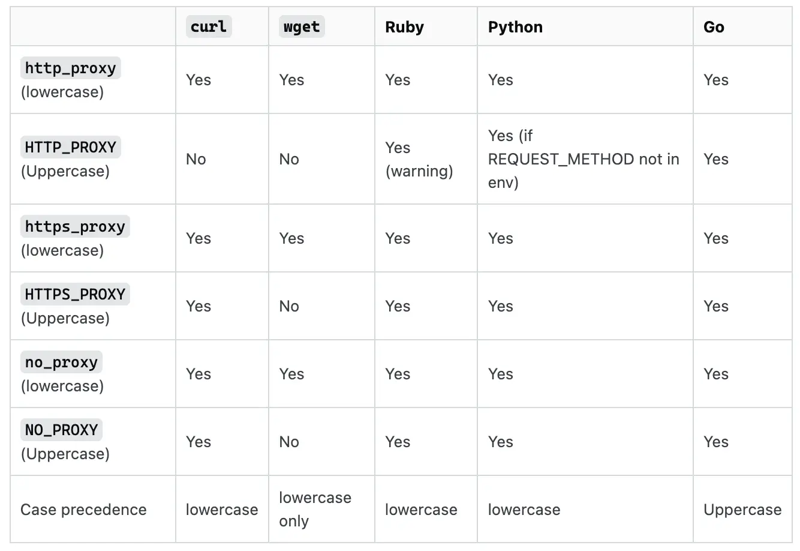

# 集群概况

目前集群硬件资源如下：

- M6 集群 共 5 个节点
    - CPU (M600,M601)：Intel Silver 4314 16Core @ 2.4GHz
    - CPU (M602,M603,M604)：Intel Gold 5320 26Core @ 2.2GHz
    - 内存：DDR4 256 GB 以上
    - Ethernet：10Gbps
    - Infiniband：HDR 200Gbps

- M7 集群 共 2 个节点
    - CPU：Intel Gold 5418Y 24Core @ 2.0GHz
    - 内存 DDR5-4800
    - Ethernet：1Gbps
    - Infiniband：HDR 200Gbps

- RISC-V 集群 ([**进迭时空**](https://www.spacemit.com/)提供) 共 2 个节点
    - CPU：Spacemit X60 @ 1.6Ghz
    - 内存：8GB
    - Ethernet：100Mbps


- V100 集群 共 32 个节点，每个节点有 2 个 GPU
    - GPU：NVIDIA V100 32GB * 2
    - Ethernet：10Gbps
    - Infiniband：HDR 200Gbps

- 鲲鹏 920 集群 共 1 个节点
    - CPU：Kunpeng 920 128Core @ 2.6GHz
    - 内存：DDR4 512 GB
    - Ethernet：10Gbps

## 存储

集群中有两个位置用于存储文件：

- `~`：6.4T SSD 阵列，你的家目录，权限仅个人，每人限额50G
- `/river`：和家目录同一个阵列，用于共享文件

这些位置均跨节点挂载，你可以在任意节点访问这些存储池。


## 网络

集群路由负责校园网 L2TP 拨号，在集群内网可以直接访问校外网络。集群内网还配置了访问国外网络的 Clash 代理服务：

- `172.25.4.253:7890`：HTTP 代理
- `172.25.4.253:7891`：SOCKS5 代理

集群节点上配置好了 proxychains4，你可以通过 `proxychains` 命令使用代理服务。例如，使用 `wget` 下载文件：

```shell
$ proxychains curl http://google.com
[proxychains] config file found: /etc/proxychains4.conf
[proxychains] preloading /usr/lib/x86_64-linux-gnu/libproxychains.so.4
[proxychains] DLL init: proxychains-ng 4.16
[proxychains] Dynamic chain  ...  172.25.2.253:7891  ...  google.com:80  ...  OK
<HTML><HEAD><meta http-equiv="content-type" content="text/html;charset=utf-8">
<TITLE>301 Moved</TITLE></HEAD><BODY>
<H1>301 Moved</H1>
The document has moved
<A HREF="http://www.google.com/">here</A>.
</BODY></HTML>
```

有些程序使用 `proxychains` 会出现问题，可以尝试设置 Linux 环境变量，有些程序能够通过这种方式识别代理：

```shell
$ export http_proxy=http://172.25.2.253:7890
$ curl http://google.com
<HTML><HEAD><meta http-equiv="content-type" content="text/html;charset=utf-8">
<TITLE>301 Moved</TITLE></HEAD><BODY>
<H1>301 Moved</H1>
The document has moved
<A HREF="http://www.google.com/">here</A>.
</BODY></HTML>
```

<figure markdown="span">
  { width=80% align=center }
  <figcaption>常见应用对环境变量代理的支持</figcaption>
</figure>
