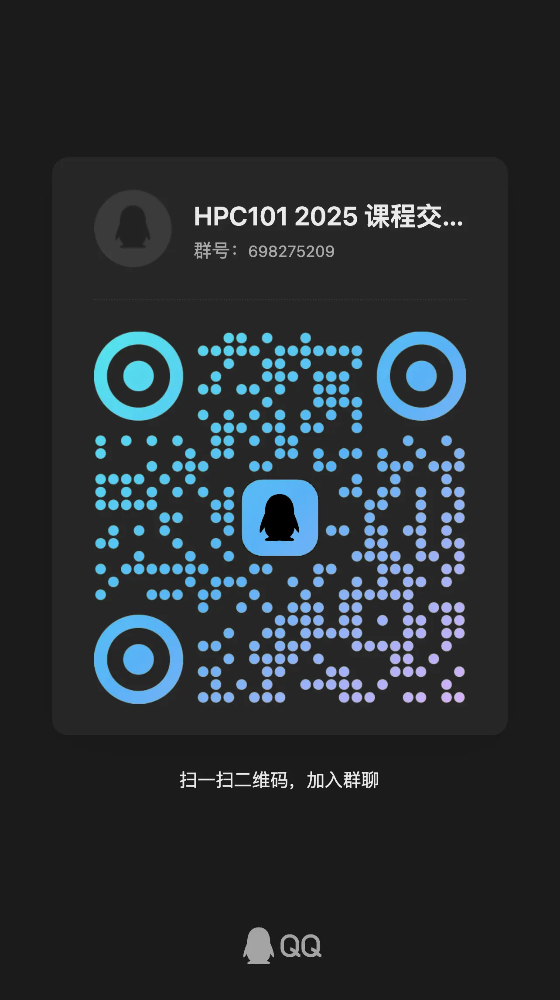
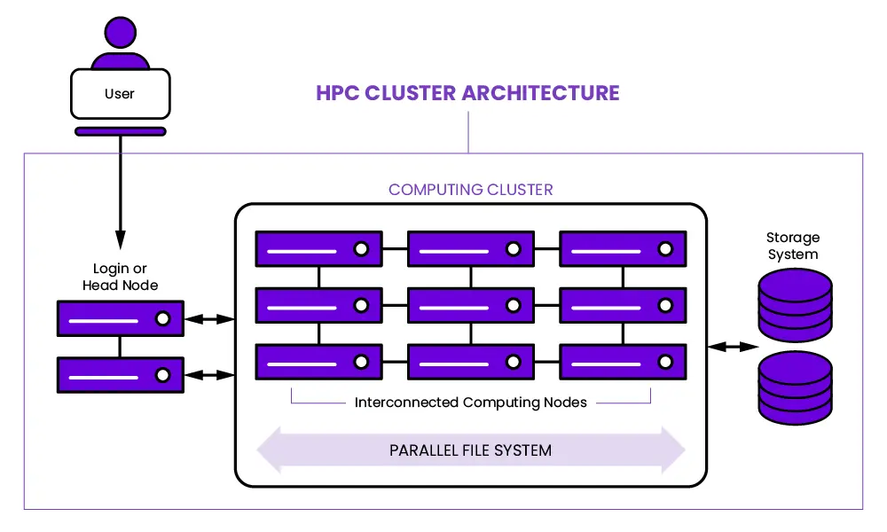
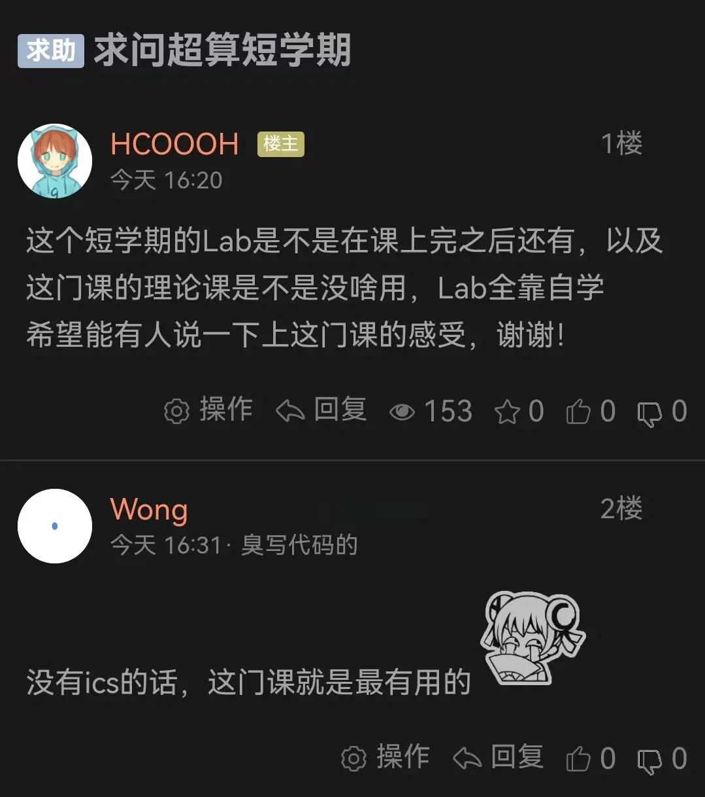
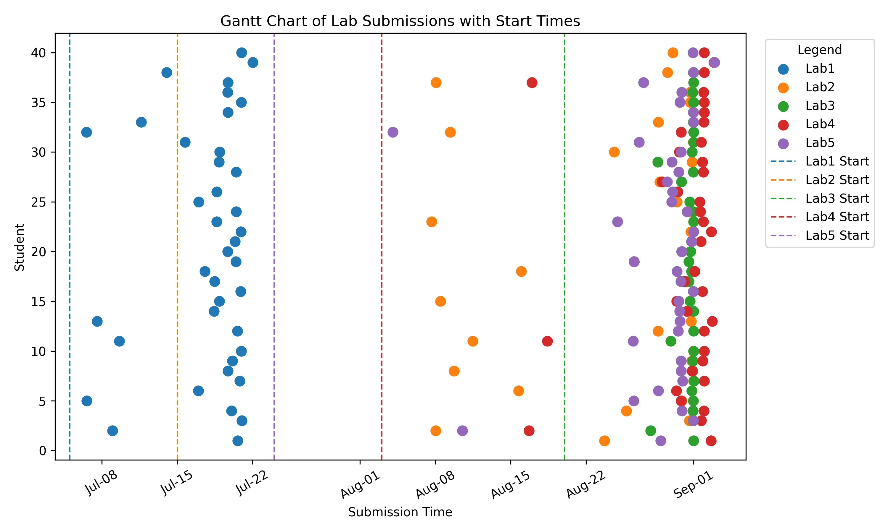

# 欢迎来到 HPC 101 超算短学期

## 课程信息

HPC 101 是浙江大学超算队开设的一门短学期课程，旨在帮助同学走进 Linux 和 HPC (高性能计算) 的世界，了解 HPC 领域的基本概念、超算的体系结构、编程技术等。

课程的正式名称是“课程综合实践 Ⅰ”，课程代码为 CS1030M，学分为 2.5 学分。

HPC 101 可以用来申请替代计算机学院非计科专业的短学期课程。

!!! tip

    因为本年度课程人数激增，因此有一些 Tips 给同学们：

    1. 硬件资源有限，在假期里请不要松懈学习。两周的课程结束后是持续两个月的各个 Lab，请合理分配时间，不要当 DDL 战神，否则结果就是在 DDL 前对着集群上无尽的任务队列抱头痛哭。
    2. 我们非常提倡同学们积极交流，可以直接在课程群内与大家交流各种问题（询问或帮助解答），只要不直接把自己的做法开源就行。也可以私戳负责对应 Lab 的助教，在课后如果有疑问也可以抓着老师和助教解决。我们的课时仅能够帮同学们引进门，接下来两个月的 Lab 极其考验同学们的自学能力。
    3. 合理使用 AI 提高效率，不依赖和盲从 AI。HPC 是比较硬核的领域，语料库很难覆盖到，因此 AI 可能不太帮得上你。你也应当为它提供相关的专业的文档作为 Prompt。
    4. 请养成认真阅读文档的习惯。在这段时间里，我们发现不少同学的问题在文档中都有解答。在 HPC101 这门课，实验文档由助教测试过，也从历年与同学们的交流中补充了很多 Tips。我们的文档质量和阅读舒适程度应该是校内课程顶尖的。所以也请同学们用心阅读。如果你发现文档有问题，可以直接提出/在 GitHub 开 Issue/提 Pr。
    5. 在提交文件的时候，尽管我们没有明确要求文件名格式，但还是希望同学们养成整理好文件名的习惯，这对于未来联系导师、投递实习简历都是有益的。我们在整理众多叫 “个人简历(1)(2).docx” 的文件时，也很难避免出现一些纰漏。但倘若改成 `324010xxxx_xxx_个人简历.pdf`，就非常清晰明确。
    6. 因为人数过多，我们会对代码进行适当查重。如果你独立完成，那么你肯定会有疑难和心得体会，这些可能作为我们反作弊的参考依据。我们希望看到同学们排版整洁、逻辑清晰的报告～

### 选课报名

<!--
!!! quote inline end "欢迎扫码进入 2025 HPC101 课程交流群了解更多信息"

    
-->

!!! warning "本课程不设置在选课系统中，有意的同学务必提前报名"

    本课程将在二轮选课后通过教学科直接将名单导入选课系统，不可以在选课系统中直接选课。

    有意选本课程的同学请不要在一轮二轮选课时选择其他 “课程综合实践Ⅰ” 课程，以免系统中出现冲突。

    被筛选的的同学仍可以参与其他课程的补选，我们会和教学科一起帮助你选课，不必担心没有课上。

!!! bug "选课报名已经截止"

请填写这份钉钉问卷：[HPC101 2026 报名表]()，务必仔细阅读问卷填写说明，确保填写的信息准确无误。问卷内容包括：

-   **个人信息**：学号等信息由钉钉自动收集。
-   **联系方式**：QQ、电话号码等。
-   **个人简介（填写文本框）**：
    -   **计科专业同学**：请简要介绍自己的技术栈、编程能力和经验、对 HPC 的了解程度等。
    -   **非计科专业同学**：请简要介绍自己的专业背景、编程能力、对 HPC 的了解程度等。
-   **实验报告（PDF 文件）**：

    -   **必须**完成 [Lab 0 Linux Crash Course](lab/Lab0-LinuxCrashCourse/index.md) 并提交实验报告。
    -   **建议**完成 [Lab 1 MiniCluster](lab/Lab1-MiniCluster/index.md) 并提交实验报告。

    !!! tip

        - 如果实验遇到困难，请及时在课程交流群内提问或私戳助教。
        - 如果因为时间安排等原因无法全部完成，可以提交部分完成的实验报告。

    我们会优先考虑实验完成度高的同学，而且实验本身是作为短学期的一次作业使用的。欢迎大家踊跃报名！

### 课程安排

-   上课时间：
    -   上午 8:30 开始，下午 14:00 开始，课时均为 3 个小时
    -   大部分时间只有半天有课，没课的时间不用到教室，课程前 6 小时有群内钉钉助手提醒
-   上课地点：紫金港校区北 3-310

| 日期       | 上午（08:30 - 11:30）              | 下午（14:00 - 17:00）                       |
| ---------- | ---------------------------------- | ------------------------------------------- |
| 6 月 25 日 | 超算概述（陈建海老师）             | 超算概述（陈建海老师）                      |
| 6 月 26 日 | -                                  | 集群软硬件及运维基础（郝星星）              |
| 6 月 27 日 | -                                  | HPC 中的计算机系统 - 1（李晨潇）            |
| 6 月 28 日 | -                                  | HPC 中的计算机系统 - 2（何水兵老师/宋浩喆） |
| 6 月 29 日 | -                                  | -                                           |
| 6 月 30 日 | -                                  | 向量化并行计算基础（陈宏哲）                |
| 7 月 1 日  | Cuda C 编程基础（王则可老师/孙杰） | Cuda C 编程基础（王则可老师/孙杰）          |
| 7 月 2 日  | OpenMP/MPI 并行计算基础（李晨潇）  | C++ 并行程序设计（朱宝林）                  |
| 7 月 3 日  | 高性能计算高级话题（王则可老师）   | -                                           |
| 7 月 4 日  | -                                  | -                                           |
| 7 月 5 日  | -                                  | 性能分析技术基础 Profiling（刘烨）          |
| 7 月 6 日  | 机器学习基础（林熙）               | 机器学习基础（林熙）                        |
| 7 月 7 日  | -                                  | 机器学习高级话题（张寅老师）                |

实验初步安排如下，**具体情况请以钉钉群内通知为准！**

| 实验名称 | 助教                   | 开始时间   | 截止时间   |
| -------- | ---------------------- | ---------- | ---------- |
| Lab 1    | 郝星星                 | 2025-06-25 | 2025-07-03 |
| Lab 2    | 陈宏哲, 刘烨, 洪奕迅   | 2025-06-30 | 2025-07-14 |
| Lab 3    | 陈楷骐, 郝星星, 任朱明 | 2025-07-14 | 2025-07-28 |
| Lab 4    | 李晨潇, 黄钰, 周俊康   | 2025-07-28 | 2025-08-11 |
| Lab 5    | 林熙, 茅晋源, 尤傲     | 2025-08-11 | 2025-08-25 |
| 大作业   | 蒋翼泽, 李厚融, 杨星宇 | 2025-07-07 | -          |

## 导言：Hello HPC World

第一次听到 HPC 这个词，你是不是觉得很陌生？没关系，我第一次听到时也是一头雾水。几乎没有学生在学习这门课程之前了解过 HPC，这是一个相对陌生的领域。在这门课程中，我们会一步步地带你走进 HPC 的世界，带你了解这个领域的基础知识和技术，带你感受到 HPC 的魅力。

!!! quote inline end ""

    

    最快的超级计算机 Frontier 每秒能提供 $10^{18}$ 次浮点运算，相当于 $10^6$ 张 4090 显卡。

### HPC 是什么？

HPC 是 High Performance Compute 的缩写，意思是高性能计算，通常是指通过**聚合计算能力**来提供比传统计算机或服务器更强大的计算性能，处理海量多维数据集（大数据），并以极高的速度解决复杂问题。HPC 系统的运行速度通常要比最快的商用台式机、笔记本电脑或服务器系统快一百万倍以上。

标准计算系统主要使用**串行计算**来解决问题，它将工作负载分成一系列任务，然后在同一处理器上依次执行这些任务。相比之下，HPC 则利用以下技术来提高计算速度：

-   **大规模并行计算**。并行计算是在多个计算机服务器或处理器上同时运行多个任务。大规模并行计算则是使用数万到数百万个处理器或处理器核心的并行计算。
-   **计算机集群**（也称为 HPC 集群）。HPC 集群由多个联网的高速计算机服务器组成，并有一个集中式调度器来管理并行计算工作负载。这些计算机被称为节点，可能会使用高性能多核 CPU，如今更有可能使用 GPU（图形处理单元），它们非常适合处理严格的数学计算、机器学习模型和图形密集型任务。单个 HPC 集群可能包括 100,000 个或更多节点。
-   **高性能组件**：HPC 集群中的所有其他计算资源（网络、内存、存储和文件系统）都是高速、高吞吐量、低延迟组件，可以与节点同步，优化集群的计算能力和性能。

下图展示了一个典型的 HPC 集群架构：



HPC 提供的超高性能，使得它在很多领域都有着广泛的应用。随着 AI 技术的发展，**HPC 应用也已成为 AI 应用的代名词**，尤其是机器学习和深度学习应用。HPC 应用正在推动以下领域的持续创新：

-   科学研究。HPC 在科学研究中的应用包括气候建模、天气预报、宇宙学、地震学、生物学、物理学、化学、材料科学和地球科学。这些学科需要处理大量数据、进行复杂的模拟和建模，以及进行大规模的数据分析。
-   医疗保健、基因组学和生命科学。人类基因组测序的首次尝试耗时长达 13 年；而如今，HPC 系统可以在不到一天的时间内完成这项工作。在医疗保健和生命科学领域，HPC 的其他应用还包括药物发现和设计、癌症快速诊断和分子建模。
-   金融服务。除了自动交易和欺诈检测，HPC 还支持蒙特卡罗模拟和其他风险分析方法的应用。
-   政府和国防。在这一领域，两个日益增长的 HPC 用例是天气预报和气候建模，这两个用例都涉及处理大量的历史气象数据和气候相关数据点每日数百万次的变化。其他政府和国防应用包括能源研究和情报工作。
-   能源。能源相关 HPC 应用包括地震数据处理、油藏模拟和建模、地理空间分析、风场模拟和地形测绘。

### 在这个短学期课程中，你会学到什么？

在这门课中，你能够学习到的知识和技能大致如下：

<div class="grid cards" markdown style="grid-template-columns: 1fr">

-   :construction_site:{ .lg .middle } **前置知识：计算机体系结构**

    ***

    要学习并行程序设计，首先要理解现有的硬件（如 CPU、GPU 等）是如何工作的、为并行做了哪些优化。并行化的目的之一，是为了最大化利用现有的硬件资源，对大量数据进行快速操作。对于 CPU，我们会了解指令集、存储器层次结构和局部性原理，知道 Cache 一致性问题的原因和解决办法，掌握 SIMD（Single Instruction Multiple Data）并行方法。对于 GPU（以 NVIDIA 为主），我们会了解流处理器（Stream Processor，SP）、CUDA Core（甚至是 Tensor Core）的组织方式，掌握 CUDA 编程的基本方法。上面只提及了最重要的知识，你应该能体会到内容非常之多且陌生，这些内容大概会用 4 天的时间完成讲授。在这门短学期课程中，我们只需要对这些知识有基本的了解即可。一定程度上，对硬件的理解越深入，并行编程技术也会越好，所以这是值得在日后深入学习的模块。

-   :computer:{ .lg .middle } **核心技术：并行编程技术**

    ***

    在本课程中，我们将学习三种经典的并行编程技术：OpenMP/MPI 和 CUDA。前者两者主要用于 CPU，后者用于 GPU（当然二者可以结合使用，不过课程中不会涉及）。表面上，学习一些 API 就能写并行程序了，但性能并不会得到很大的提升。基于对现有硬件的理解进行针对性的优化是非常重要的一环。

    在基本的 API 之外，我们还将学习并行算法，深入体会不同算法的特点，以及如何根据硬件特性进行选择。并行编程的难点在于数据的并行化和任务的并行化，这需要对算法有深入的理解。因此你也需要经常阅读经典例程、他人的优化思路和效果，学习并积累经验。对 CUDA 来说，多看例程尤为重要。CUDA 提供了多层次的 API，我们使用的主要是 CUDART（CUDA RunTime API）。它与具体的 CUDA 硬件无关，但你仍然需要考虑数据会如何被存储在具体的硬件上、如何优化存取、运算和线程调度。比如，在 2080Ti 上调优过的程序，在 A100 上的性能表现可能会大打折扣。

-   :penguin:{ .lg .middle } **辅助技术：Linux 相关**

    ***

    本课程全程使用 Linux 环境。如果你对 Linux 系统有过一定了解和经验，或是曾经用服务器搭建过网站并持续使用等，那么你的实验流程会十分舒适。不过没有基础也不必担心，集群使用 Slurm 和 Lmod 进行管理，配置环境和运行任务都非常方便。我们也会在课程中讲解如何使用这些工具，以及如何在集群上提交任务。如果出现问题，你可以随时询问运维人员，他们会很乐意帮助你解决问题。

-   :robot:{ .lg .middle } **附加技术：科学计算、AI 相关**

    ***

    在第 2 个 Lab，你会接触科学计算中关键的工具：NumPy。在最后一个 Lab，你将会揭开大模型的面纱，自己编写一个 Transformer，并进行训练和推理。课程会花约 2 天时间讲授 AI 基础。这次实验，或许是你第一次真正理解那些神秘的 AI 究竟是怎么用实际的代码构建起来的。

</div>

### 修读建议

!!! quote inline end ""

    

阅读完上面的介绍，相信你已经初步了解了自己将要学习哪些内容。再回顾一下计算机系的培养方案，你会看见这些内容贯穿了整个计算机专业的学习。因此，有同学在 98 上评论“没有 ICS（计算机系统概论）的话，这门课就是最有用的”，这句话是相当正确的。HPC101 是一门非常有挑战性的课程，知识量大且难，注重实践操作，但也是一门非常有趣的课程。如果你对计算机体系结构、并行编程、AI 等方面有浓厚的兴趣，那么这门课程将会是你的一次深度学习之旅。

或许在进入计算机专业以来，你已经多次听到「CS 人的基本素养就是自学能力」这样的言论。这句话在 HPC101 中将会得到最好的体现。HPC 领域的知识广阔，我们难以在 14 \* 2 个课时里向你讲授所有内容。事实上，这些课时只够上导论，能够让你对相关知识有一个基本的了解就已经达到了目的。因此，你注定要在课后花费一定时间和精力去深入学习，在 Lab 中尝试应用并真正理解。我们会提供一些资源和参考资料，帮助你更好地学习。希望你能够在课程中坚持**自发地学习**，收获满满的知识和技能。我们也非常鼓励你在学习过程中多多提问，多多交流，这样你会学得更快更好。

### 资源推荐

-   [thu-cs-lab/HPC-Lab-Docs 清华大学高性能计算导论实验文档](https://lab.cs.tsinghua.edu.cn/hpc/doc/)：作为国内超算课程建设的标杆，清华大学的 HPC 课程已经开设多年，积累了丰富的经验和资料。
-   [Linux 101 - USTC](https://101.lug.ustc.edu.cn/)：中科大拥有国内高校最大的 Linux User Group，其开设的 Linux 入门课程内容丰富，适合初学者。
-   [《并行程序设计导论》](https://book.douban.com/subject/20374756/)（An Introduction to Parallel Programming）
    -   很薄，介绍了 OpenMPI 和 OpenMP（Pthreads 我们不学，也基本不会接触到）。讲解的内容浅显易懂，适合快速入门。
-   Python 编程三剑客：从上至下，书籍难度逐渐递增。如果你对自己的编程能力不太自信，选择第一本书。如果你编程能力好，但没接触过 Python，可以选择第二本。如果你对 Python 有一定了解，非常推荐你直接从第三本开始做一些简单的项目。
    -   [《Python 编程 : 从入门到实践（第 3 版）》](https://book.douban.com/subject/36365320/)（Python Crash Course）
        -   项目推荐：数据可视化、Web 应用程序
    -   [《Python 编程快速上手：让繁琐工作自动化》](https://book.douban.com/subject/35387685/)（Automate the Boring Stuff with Python, 2nd Edition: Practical Programming for Total Beginners）
        -   项目推荐：从 Web 抓取信息，处理 CSV 文件和 JSON 数据，保持时间、计划任务和启动程序
    -   [《Python 极客项目编程》](https://book.douban.com/subject/27050630/)（Python Playground: Geeky Projects for the Curious Programmer）
        -   项目推荐：模拟生命、图片之乐
-   [《Programming Massively Parallel Processors: A Hands-on Approach, 4th Edition》](https://www.oreilly.com/library/view/programming-massively-parallel/9780323984638/)
    -   CUDA 编程目前仍在活跃发展中，因此没有合适的中文书籍。要想学习到最新的 CUDA 技术，只能看英文书籍，而且要看最新版，超过 5 年的书籍均可能过时。

## FAQ

!!! question "感觉自己编程基础比较弱，适合选这门课吗？"

    大一期间，同学们一般都已经修过 **C 语言课程**（如《C 程序设计》和《数据结构基础》），具备一定的 C 语言基础。在超算短学期中，我们将接触的几种并行编程框架（如 **CUDA、MPI 和 OpenMP**）都是基于 C/C++ 语言的。只要你在这些课程的学习情况不是太差，就已经具备了修读本课程的**基础编程能力**。

!!! question "有什么预修要求/我需要做什么准备吗？"

    如上所述，只需要有 **C 语言基础**即可。我们理解大家临近期末课业繁重，**Lab 1 的报告仅作为报名时的可选项**。这个 Lab 的目的是让大家提前熟悉 **Linux 系统和集群环境**，了解高性能计算中软件的编译和运行模式，这些内容在短学期课程中都会详细讲解。如果在 Lab 中遇到困难，请善用 **Google、Stack Overflow** 等搜索引擎，学会阅读官方文档（Read The Manual），这些技能会极大提升你的计算机学习能力。如果有余力，推荐阅读 Peter Pacheco 的《**并行程序设计导论**》，其中介绍的 **MPI/OpenMP** 是我们将要学习的重要内容。此外，**Python 编程能力**对修读本课程及其他短学期课程（如 AAA）也非常有帮助，建议加入学习计划。

!!! question "担心自己和“大神”差距很大怎么办？"

    不必担心。内容和形式对于大家来说都是**全新的**，几乎没有同学在大一及之前就接触过并行编程。大家基本都处于**同一起跑线**，主要差异在于编程语言的熟练程度，这会影响学习速度，但不会影响最终的学习成果。以往的经验来看，无论是否有 OI 基础，大家都能跟上进度。短学期的时间安排较为宽松（但请不要因此放松），大约**两周高密度学习**，之后有**两个月时间逐步消化并完成各个 Lab**，最后组队完成 Project。这样的安排也与超算竞赛的形式类似：与 CTF、ACM 等短时竞赛不同，**HPC 竞赛通常持续数月甚至半年**，有充足时间自主安排、深入研究、团队合作。我们也鼓励大家在学习过程中**多交流、互相帮助**。

!!! question "课程有名额限制吗？"

    教学科没有明确的名额限制，但我们会根据报名情况进行筛选。

!!! question "硕博可以选吗？"

    可以，同样由教学科导入系统。

!!! question "其他专业可以选吗？如何替换本专业培养方案的课程？"

    可以，一般是算作个性化学分。如果需要替换本专业培养方案的课程，请联系教学科确认。

    替换流程一般为：课程结束后在教务系统上免修申请（拿到学分后随时可申请），一般是学期初审核。

!!! question "可以旁听吗？"

    如果你因为时间冲突等原因无法选课，但仍然希望旁听课程内容，可以：

    - 在智云课堂上旁听该课程。
    - 通过课程仓库获取课程资料，我们会将实验文档、部分课件和代码等资料同步到本仓库。
    - 欢迎加入课程交流群，我们会在群内同步课程消息。

    如需申请集群账户以便进行实验和练习，请同样填写报名表，并选择“旁听”选项。由于集群计算资源有限，我们将同样根据报名情况进行筛选。

    我们为旁听同学提供实验环境，但不负责批改旁听同学实验报告。关于 OJ 评测等，与正常选课的同学共享 DDL，Lab 截止后可能无法继续提供环境支持。

如果在做 Lab 过程中遇到问题或有其他疑问，欢迎在交流群内提问或私聊助教，我们会尽力解答。

## 历史

本节记录 HPC 101 超算短学期课程的历史版本、重要里程碑和一些统计数据。

-   课程规模：

    | 年份 | 课程规模                       |
    | ---- | ------------------------------ |
    | 2025 | 109（本）+ 3（研）+ 7 （旁听） |
    | 2024 | 41                             |
    | 2023 | 36                             |
    | 2022 | 29                             |

-   Lab 提交时间分布（绘制 Python 脚本位于 [index.assets/statistics/submission.py](index.assets/statistics/submission.py)）：

    | 年份 | 分布                                                             |
    | ---- | ---------------------------------------------------------------- |
    | 2024 |  |

-   报名表提交时间分布：

    | 年份 | 分布                                                               |
    | ---- | ------------------------------------------------------------------ |
    | 2025 |  |

## 贡献

课程的历史版本保存于仓库的不同分支中，当前版本为 `main` 分支。为了加快速度，你可以在克隆时指定单个分支：

```bash
git clone -b main --single-branch git@github.com:ZJUSCT/HPC101.git
```

在本地构建并预览文档：

```bash
pip install -r requirements.txt
mkdocs serve # 预览课程文档
mkslides serve slides # 预览课程幻灯片
```

课程实验文件夹布局如下：

```text
Lab0-Example
├── index.md：实验文档
├── image：实验相关图片
└── code：实验基础代码等
```

图片请使用 `.webp` 格式，它能够显著减小图片体积。你可以使用下面的命令批量转换图片格式：

```bash
find . -type f \( -iname "*.jpg" -o -iname "*.jpeg" -o -iname "*.png" \) -exec sh -c 'cwebp "$1" -o "${1%.*}.webp" && rm "$1"' _ {} \;
```

课程图标使用了两种英文字体，可以在 [FontSpace](https://www.fontspace.com/) 上找到：

-   Sekath Italic
-   Supercharge

课程幻灯片存放在 `beamer` 目录下，基于 zjusct-beamer 主题构建。布局如下

```text
beamer
├── Makefile：构建脚本
├── day1.tex：第一天的幻灯片
├── day2.tex：第二天的幻灯片
├── day1
│   ├── sections：第一天的章节
│   └── img：第一天的图片
├── day2
│   ├── sections：第二天的章节
│   └── img：第二天的图片
└── zjusct-beamer：zjusct-beamer 主题文件夹
```

要构建某天的幻灯片，目标为对应的文件名，例如 `make day1.tex`。构建后会在当前目录下生成 PDF 文件。

在提交前，请运行 `make lint && make clean`。不要把构建完成的 PDF 文件提交到仓库中。

??? info "MkSlides is deprecated"

    课程幻灯片存放在 `slides/` 目录下，使用 [MartenBE/mkslides](https://github.com/MartenBE/mkslides/) 构建到 MkDocs 构建后的目录下然后部署，以实现 MkDocs 和 mkslides 的集成。参考下列样式修改：

    - [HoGentTIN/cdn](https://github.com/HoGentTIN/cdn/blob/main/styles/reveal-js/slides.css)
    - [HoGentTIN/linux-slides](https://github.com/HoGentTIN/linux-slides/blob/main/hogent.css)
    - [TonyCrane/slide-template](https://github.com/TonyCrane/slide-template/blob/master/slide/src/custom.css)
