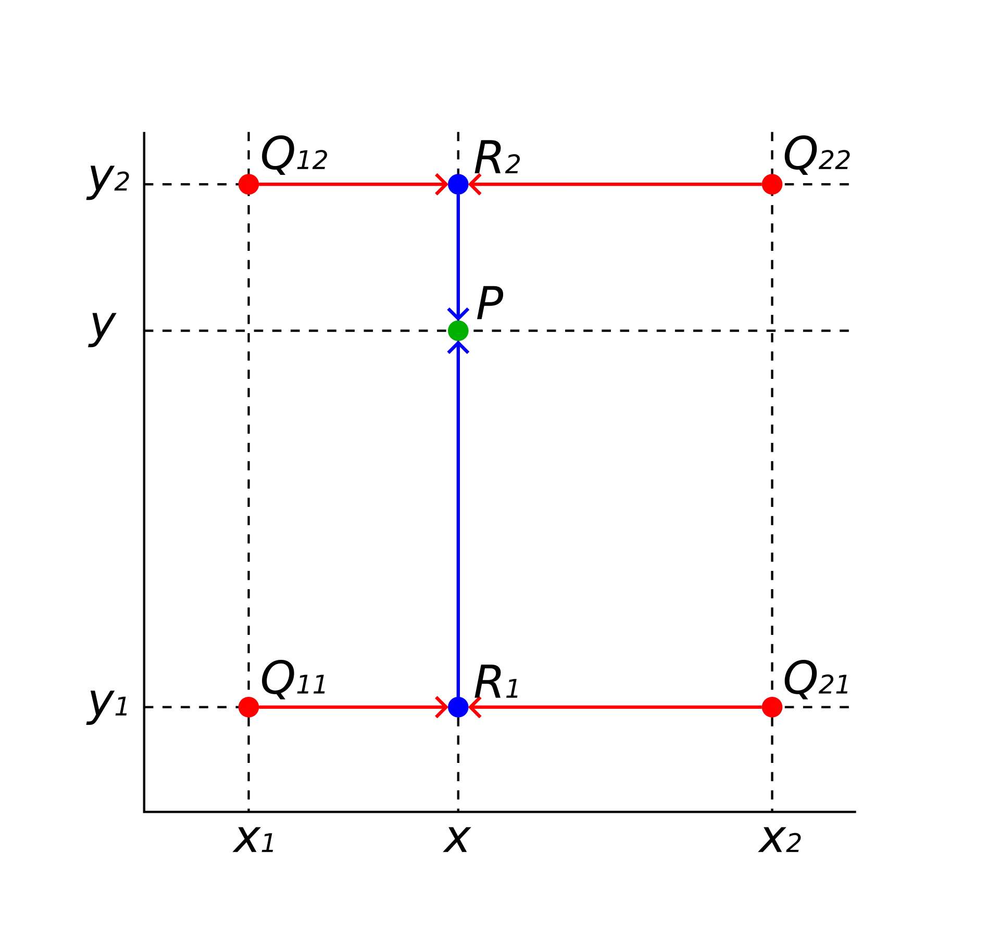
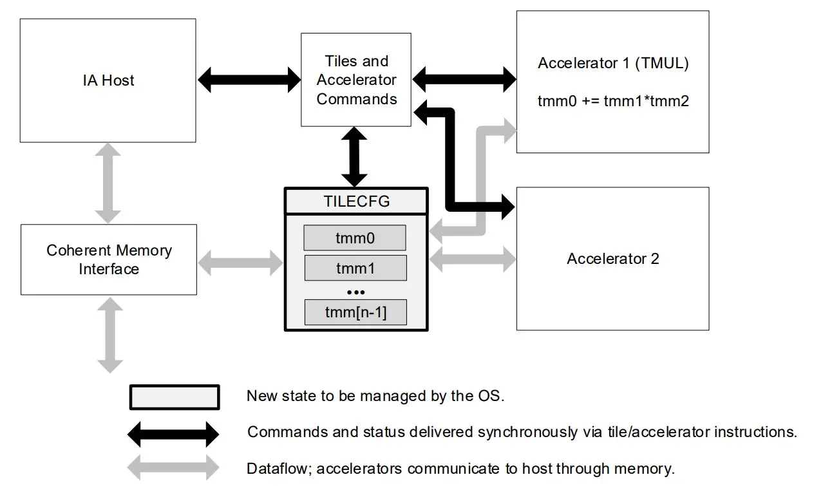

# 实验二：向量化计算

!!! tip "QC PASS"

    本实验流程已经通过检查，请放心食用。

    负责助教：陈宏哲, 刘烨, 洪奕迅

## 实验目的

本次实验目的是让大家对「向量化并行计算」进行更加深入的了解，以 Numpy 的向量化计算为基础，进一步学习 CPU 中专为向量化计算设计的 SIMD 指令扩展，如 AVX, AMX 扩展。

实验文档主要分为三大部分，他们分别的作用是:

- Numpy 中的向量化计算: 供大家结合课上所学，熟悉 Numpy 的向量化编程模式，需要大家在阅读后完成对应的思考题
- x86-64 SIMD 优化: 介绍当前科学计算、深度学习等领域主要使用的 AVX-512 和 AMX 指令集，需要大家学习并完成手写向量化 Intrinsic 优化矩阵乘法的代码任务


## 知识讲解: Numpy 中的向量化计算

### 工具介绍

[NumPy](https://numpy.org/) 是 Python 中科学计算的基础包。它是一个 Python 库，提供多维数组对象，各种派生对象（如掩码数组和矩阵），以及用于数组快速操作的各种 API，有包括数学、逻辑、形状操作、排序、选择、输入输出、离散傅立叶变换、基本线性代数，基本统计运算和随机模拟等等。

Numpy 代码一般采用向量化（矢量化）描述，这使得代码中没有任何显式的循环，索引等，这样的代码有以下好处：

- 向量化代码更简洁，更易于阅读
- 更少的代码行通常意味着更少的错误
- 代码更接近于标准的数学符号

另外，向量化的代码能够规避掉 Python 中缓慢的迭代循环，被底层的实现更好的调度，如接入 BLAS 矩阵运算库，从而实现更高的性能。

双线性插值是计算机视觉图像处理中的常用算法，它在计算机图形学中也可以用于材质贴图的重采样。

下面我们将给出一个使用 Numpy 来优化 Python 代码的例子，例子实现了一个支持批量处理的向量化的双线性插值，来让大家熟悉 NumPy 的向量化编程模式。

### 双线性插值算法简述

概括来说就是先在 $x$ 轴上进行一次插值，再在 $y$ 轴上进行一次插值。


以在灰度图上进行插值为例，我们已知外围的四个点 $(14, 20), (15, 20), (14, 21), (15, 21)$ 灰度值分别为 91, 210, 162 和 95，然后希望通过插值得到 $(14.5, 20.2)$ 处的灰度值。

接下来我们先在 $x$ 方向上通过线性插值计算出 $(14.5, 20), (14.5, 21)$ 两个点的灰度值 150.5, 128.5，然后再使用这两个值在 $y$ 方向上再次进行线性插值，得到 $(14.5, 20.2)$ 坐标处的灰度值 146.1。

注意这里是一个单通道的例子，对于实际的情况，我们往往有很多个通道，如彩色图片拥有 RGB 三个通道，一些图片可能还有 $\alpha$ 透明度通道，或是深度通道。**对于多通道的情况，我们需要对每个通道进行分别插值。**

#### 形式化定义

> 形式化定义摘自[维基百科](https://en.wikipedia.org/wiki/Bilinear_interpolation)

假如我们想得到未知函数 $f$ 在点 ${\displaystyle P=\left(x,y\right)}$ 的值，假设我们已知函数 $f$ 在 ${\displaystyle Q_{11}=\left(x_{1},y_{1}\right)}$, ${\displaystyle Q_{12}=\left(x_{1},y_{2}\right)}$, ${\displaystyle Q_{21}=\left(x_{2},y_{1}\right)}$ 及 ${Q_{22}=\left(x_{2},y_{2}\right)}$ 四个点的值。

!!! note "双线性插值"

    <center>{ width=50% }</center>

首先在 $x$ 方向进行线性插值，得到

$$
{\displaystyle {\begin{aligned}f(x,y_{1})&\approx {\frac {x_{2}-x}{x_{2}-x_{1}}}f(Q_{11})+{\frac {x-x_{1}}{x_{2}-x_{1}}}f(Q_{21}),\\\\
f(x,y_{2})&\approx {\frac {x_{2}-x}{x_{2}-x_{1}}}f(Q_{12})+{\frac {x-x_{1}}{x_{2}-x_{1}}}f(Q_{22}).\end{aligned}}}
$$

然后在 $y$ 方向进行线性插值，得到

$$
{\displaystyle {\begin{aligned}f(x,y)&\approx &&{\frac {y_{2}-y}{y_{2}-y_{1}}}f(x,y_{1})+{\frac {y-y_{1}}{y_{2}-y_{1}}}f(x,y_{2})\\\\
&=&&{\frac {y_{2}-y}{y_{2}-y_{1}}}\left({\frac {x_{2}-x}{x_{2}-x_{1}}}f(Q_{11})+{\frac {x-x_{1}}{x_{2}-x_{1}}}f(Q_{21})\right)\\\\
&&&+{\frac {y-y_{1}}{y_{2}-y_{1}}}\left({\frac {x_{2}-x}{x_{2}-x_{1}}}f(Q_{12})+{\frac {x-x_{1}}{x_{2}-x_{1}}}f(Q_{22})\right)\\\\
&=&&{\frac {1}{(x_{2}-x_{1})(y_{2}-y_{1})}}{\big (}f(Q_{11})(x_{2}-x)(y_{2}-y)+f(Q_{21})(x-x_{1})(y_{2}-y)\\\\
&&&+f(Q_{12})(x_{2}-x)(y-y_{1})+f(Q_{22})(x-x_{1})(y-y_{1}){\big )}\\\\
&=&&{\frac {1}{(x_{2}-x_{1})(y_{2}-y_{1})}}{\begin{bmatrix}x_{2}-x&x-x_{1}\end{bmatrix}}{\begin{bmatrix}f(Q_{11})&f(Q_{12})\\\\
f(Q_{21})&f(Q_{22})\end{bmatrix}}{\begin{bmatrix}y_{2}-y\\\\ y-y_{1}\end{bmatrix}}.\end{aligned}}}
$$

注意此处如果先在 $y$ 方向插值、再在 $x$ 方向插值，其结果与按照上述顺序双线性插值的结果是一样的。

#### NHWC 数据格式

真实情况下我们处理的数据都是以 batch 为单位的，按批进行处理的。以双线性插值为例，我们往往会一次性送入 $N$ 张大小为 $H \times W$ 的图片，每个像素上有 $C$ 个通道，然后一次性返回这 $N$ 张图片处理好的结果。此时我们一次性传入的数据，就是直接按顺序堆叠在一起的 NHWC 格式的数组，它将 batch 作为了第一个维度，而后三个维度分别是单张图片的高度、宽度、通道数。你可以将这一数据格式理解为 c 语言中的高维数组 `image[N][H][W][C]`，而因为 c 的数组和 NumPy 的 `ndarray` 一样都是在内存里连续排放的，所以对于 `image[x1][x2][x3][x4]`，其实就是 `image[x1 * H * W * C + x2 * W * C + x3 * C + x4]` 处的内存。

另一个常见的数据格式是 NCHW，也就是单张图片内通道在前，不过这里我们没有选用。

数据格式更多是对数据的存放顺序进行约定，通过 `np.transpose` 可以方便地将不同维度进行调换。

### 基准代码

下面给出直接使用 `for` 循环迭代计算的双线性插值版本：

```python linenums="1"
def bilinear_interp_baseline(a: np.ndarray, b: np.ndarray) -> np.ndarray:
    """
    This is the baseline implementation of bilinear interpolation without vectorization.
    - a is a ND array with shape [N, H1, W1, C], dtype = int64
    - b is a ND array with shape [N, H2, W2, 2], dtype = float64
    - return a ND array with shape [N, H2, W2, C], dtype = int64
    """
    # Get axis size from ndarray shape
    N, H1, W1, C = a.shape
    N1, H2, W2, _ = b.shape
    assert N == N1

    # Do iteration
    res = np.empty((N, H2, W2, C), dtype=int64)
    for n in range(N):
        for i in range(H2):
            for j in range(W2):
                x, y = b[n, i, j]
                x_idx, y_idx = int(np.floor(x)), int(np.floor(y))
                _x, _y = x - x_idx, y - y_idx
                # For simplicity, we assume:
                # - all x are in [0, H1 - 1)
                # - all y are in [0, W1 - 1)
                res[n, i, j] = a[n, x_idx, y_idx] * (1 - _x) * (1 - _y) + \
                               a[n, x_idx + 1, y_idx] * _x * (1 - _y) + \
                               a[n, x_idx, y_idx + 1] * (1 - _x) * _y + \
                               a[n, x_idx + 1, y_idx + 1] * _x * _y
    return res
```

### Numpy 向量化实现

通过花式索引和 Numpy 向量化，把 Baseline 的三层循环全部替换。

```python linenums="1"
import numpy as np
from numpy import int64

def bilinear_interp_vectorized(a: np.ndarray, b: np.ndarray) -> np.ndarray:
    """
    This is the vectorized implementation of bilinear interpolation.
    - a is a ND array with shape [N, H1, W1, C], dtype = int64
    - b is a ND array with shape [N, H2, W2, 2], dtype = float64
    - return a ND array with shape [N, H2, W2, C], dtype = int64
    """
    N, H1, W1, C = a.shape
    N1, H2, W2, _ = b.shape
    assert N == N1

    res = np.empty((N,H2,W2,C), dtype=int64)

    x = b[:,:,:,0]
    y = b[:,:,:,1]
    x_idx = np.floor(x).astype(int64)
    y_idx = np.floor(y).astype(int64)
    x_mul = (x - x_idx)[:,:,:,None]
    y_mul = (y - y_idx)[:,:,:,None]
    n_idx = np.arange(N)[:,None,None]
    res[:] = a[n_idx, x_idx, y_idx] * (1 - x_mul) * (1 - y_mul) + \
             a[n_idx, x_idx + 1, y_idx] * x_mul * (1 - y_mul) + \
             a[n_idx, x_idx, y_idx + 1] * (1 - x_mul) * y_mul + \
             a[n_idx, x_idx + 1, y_idx + 1] * x_mul * y_mul

    return res
```

### 推荐阅读材料

- 关于双线性插值：[https://en.wikipedia.org/wiki/Bilinear_interpolation](https://en.wikipedia.org/wiki/Bilinear_interpolation)
- NumPy 文档：[https://numpy.org/doc/stable/](https://numpy.org/doc/stable/)
- 一篇不错的入门教程：[https://medium.com/better-programming/numpy-illustrated-the-visual-guide-to-numpy-3b1d4976de1d](https://medium.com/better-programming/numpy-illustrated-the-visual-guide-to-numpy-3b1d4976de1d)
- 一篇稍微硬核一点的教程：[https://www.labri.fr/perso/nrougier/from-python-to-numpy/](https://www.labri.fr/perso/nrougier/from-python-to-numpy/)
- 更多练习：[https://github.com/rougier/numpy-100](https://github.com/rougier/numpy-100)

## 知识讲解: x86-64 SIMD 优化

### AVX 向量指令扩展

现代处理器一般都支持向量化指令，x86 架构下 Intel 和 AMD 两家的处理器都提供了诸如 SSE，AVX 等 SIMD 指令集，一条指令可以同时操作多个数据进行运算，大大提高了现代处理器的数据吞吐量。

现代编译器在高优化等级下，具有自动向量化的功能，对于结构清晰，循环边界清晰的程序，编译器的自动向量化已经可以达到很优秀的程度了。然而，编译器的优化始终是保守的，很多情况下编译器无法完成使用 SIMD 指令进行向量化的工作，为了追求性能，高性能计算领域经常需要手写 SIMD 代码进行代码优化。

显然直接手写汇编指令过于困难，在 C 语言环境下，Intel 提供了一整套关于 SIMD 指令的函数封装接口和指令相关行为的参照手册，可以在实验文档的参考资料中找到。

使用这些函数 API 需要 include 对应的头文件，不同 SIMD 指令集需要的头文件不同，具体需要参考 Intel 相关文档。

```c
#include <smmintrin.h>
#include <emmintrin.h>
#include <immintrin.h>
```

另外深入到这个级别的优化已经开始需要考虑具体处理器的体系结构细节了，如某个架构下某条指令的实现延时和吞吐量是多少，处理器提供了多少向量寄存器，访存的对齐等等。这种时候编译器具体产生的汇编代码能比 C 语言代码提供更多的信息，你能了解到自己使用了多少寄存器，编译器是否生成了预期外的代码等等。

### AVX-512

[AVX-512](https://www.intel.com/content/www/us/en/docs/intrinsics-guide/index.html) (Advanced Vector Extensions 512-bit) 是 x86 架构中目前的 SIMD 指令集，通过 512 位宽寄存器和增强指令集为高性能计算提供突破性加速。在矩阵乘法等线性代数运算中，能发挥巨大作用：

- **并行计算优势**：AVX 的 512 位寄存器能单周期处理 16 个 32 位浮点数（FP32），相比标量运算提升 16 倍吞吐量
- **内存访问优化**：`vmovaps` 等指令支持对齐内存加载，减少数据搬运开销
- **融合运算能力**：`vfmadd` 等融合乘加指令在单周期完成乘法和累加操作

可以来看一下 SIMD 指令集的演进：

| 指令集        | 推出年份  | 寄存器宽度   | 寄存器数量   | 峰值吞吐增益（FP32）   |
|--------------|----------|------------|------------|----------------------|
| MMX          | 1996     | 64-bit     | 8          | 2x (INT8)            |
| SSE          | 1999     | 128-bit    | 8          | 4x (FP32)            |
| AVX/AVX2     | 2011/2013| 256-bit    | 16         | 8x (FP32)            |
| AVX-512      | 2016     | 512-bit    | 32         | 16x (FP32)           |
| AMX          | 2021     | 1024-bit   | 8 (TILE)   | 专用矩阵加速         |

AVX-512 VNNI (Vector Neural Network Instructions) 专为卷积神经网络设计，提供了整数与低精度浮点数的运算加速指令。在本次实验中，我们对 8-bit 相乘、32-bit 累加的操作，除了使用传统的数据类型转换指令，还可以借助 AVX-512 VNNI 指令直接一步到位，减少操作次数。


### AMX 高级矩阵扩展

AMX 是 Intel 推出的一种高级矩阵扩展，它能操纵 1024 Byte 的寄存器（称为 1 个 Tile）进行乘加运算。根据实际操作，它比 AVX-512 在运算速度上有着巨大的提升。显然，根据位宽，它的吞吐量比 AVX-512 大了 16 倍，但是它需要 16 个时钟周期才能结束一次运算，那么它究竟快在哪里呢？答案是访存提升了，使用 AMX 能够更大程度的复用寄存器，这样就省去了大量的 load 和 store 开销；不仅如此它的运算单元独立于其他运算，所以可以异步处理，将延迟隐藏在其他的任务中。不过 AMX 的运算只能以 8 位和 16 位为单位，运算单元的精度较低，所以广泛地应用于大语言模型、深度学习等领域。

#### 硬件结构

AMX 的硬件结构由两大部分组成: Tile 和 Accelerator。
- Tile 是存储数据的 tmm 寄存器，每个 1024 Byte (1KB) 大小，目前共有 8 个（不过从官方文档的更新来看，最新的芯片应该支持 16 个 Tile 了）
- Accelerator 是对这些数据进行的运算，目前只有一个 TMUL，用来实现 C[M][N] += A[M][K] * B[K][N]。



#### Tile Config 配置
AMX 运算由 Tile Config (TILECFG) 来控制，它的格式如下:

```
format of memory payload. each field is a byte.
0: palette_id
1: startRow (8b)
2-15: reserved (must be zero)
16-17: tile0.colsb -- bytes_per_row
18-19: tile1.colsb
20-21: tile2.colsb
...
46-47: tile15.colsb
48: tile0.rows
49: tile1.rows
50: tile2.rows
...
63: tile15.rows
```

#### AMX 矩阵乘法详解

AMX 的 TMUL 复用了 16 个 AVX VNNI 计算单元，在 1 Cycle 进行 16 次 AVX-512 VNNI 运算，16 Cycle 得出 Tile 乘积。

这里给出 TMUL 计算的图示：


这里的 $A_{ij}$ 和 $B_{ij}$ 是 32-bit 的，这点很重要，后面实际进行计算的单位是 16-bit 或者 8-bit，我们以 16-bit 作为例子，则需要 2 个元素和作为一个单元参与计算。把这 2 个元素代入上面的图示，你会发现这个 AVX VNNI 计算单元实际上和普通的矩阵乘法的行乘列是不一样的：普通矩阵乘法的 B 矩阵应该是 (K * 2) * N 这个形状的，而 TMUL 所使用的 B 矩阵的形状是 K * (N * 2)。所以为了使用 AMX 的乘加运算，我们需要对 B 矩阵进行重排（reshape）。

我们先从图的角度来理解一下这个重排（里面每一个方块表示一个 16 -bit 的元素）：


聪明的你一定发现了，这其实就是把 B 矩阵以 32-bit 为单位进行转置。这部分代码因为对新手比较不友好所以我在 `reshape.cpp` 里直接给出了两种实现方法，你可以挑选其中一种进行阅读，之后在报告中回答相应问题。

在进行了重排之后，就可以使用 AMX 指令进行矩阵运算了，这一部分的代码就像填空题一样，在课上我们讲过了一个非常公式的方法，你需要在这里进行使用。因此，这里就给出一个比较简单的流程（如果你不熟悉的话，请去官方文档那里看伪代码）：
 
1. 确定 A，B，C 矩阵以及他们的形状和类型（这一步应当发生在重排之前）
2. 根据形状配置 TILECFG（实验已经进行了 16 个元素的对齐，确保能够铺满）
3. 使用 `__tile_loadd` 把 A，B 矩阵 load 到 Tile，同时使用 `__tile_zero` 初始化 C 矩阵对应的 Tile。
4. 根据 A，B 矩阵的类型选择对应的运算指令进行计算，结果累加到结果 Tile 里。
5. 使用 `__tile_stored` 把结果存入 C 矩阵。

提供的代码 tile.h 中提供了 `init_tile_config` 函数来对 Tile 进行操纵。

## 任务一: 使用 AVX 指令集实现整数矩阵乘法

### 背景与任务

矩阵乘法是 Attention 机制的核心操作，在现代的深度学习模型，尤其是 LLM 中，矩阵乘法占据了计算量的绝大部分。为了加速 LLM 推理，学界提出了各种优化方法，而「量化」就是其中之一。通过量化，虽然牺牲模型权重的精度，但能提高内存带宽的利用效率，减少权重的内存占用。与科学计算领域的矩阵乘法不同，本次实验，我们考虑低精度 8-bit 整数的矩阵乘法。

任务一要求使用 AVX-512 Intrinsic 实现一个基础矩阵乘法，也就是 `C = A * B` 的形式，其中 A 的形状是 `M * (K * 4)`，B 的形状是 `N * (K * 4)`.

里面的元素都是 8-bit 的值，然后通过点积得到的 C 矩阵的形状是 `M * N`，其中的元素是 32-bit 的值。在本次实验里，我们为了让内存访问更加的友好，可以认为对 B 矩阵预先做了转置操作，因此最终的矩阵乘法变成了行乘行的形式，在理解基准代码时需要注意。

**本次实验任务的代码框架在文档仓库的 `src/lab2/vector/` 目录下。**

!!! danger "修改范围限制"

    **只允许**在 `start` 和 `end` 围出来的区域里添加代码。根据是否选择做 bonus（AMX 的矩阵乘法）选择对应的代码区域进行填写。


### 基准代码讲解

Baseline 用了 3 重 `for` 循环来暴力计算矩阵乘，这也是最常见的写法，其中传进来的参数就是我们上面定义的形状中的 M，N，K。

同学们的任务是使用 AVX-512 Intrinsic 编写和 `naive_gemm` 功能相同的矩阵乘法，并实现一定的加速。

```cpp linenums="1"
void naive_gemm(uint8_t* A, int8_t* B, uint32_t* C, int m, int n, int k) {
    for (int i = 0; i < m; i++) {
        for (int j = 0; j < n; j++) {
            for (int kk = 0; kk < k * 4; kk++) {
                C[i * n + j] += A[i * k * 4 + kk] * B[j * k * 4 + kk];
            }
        }
    }
}
```

!!! tip "优化提示"

    在优化的代码中，我们首先使用 reshape 函数对 B 矩阵数据进行了 32-bit 级别的转置，转置之后的乘法操作可以参考下面的代码进行理解，在此基础上进行向量优化:

    ```cpp linenums="1"
    // start
    for (int i = 0; i < M; i++) {
        for (int j = 0; j < N; j++) {
            for (int k = 0; k < K; k++) {
                for (int n = 0; n < 4; n++) {
                    C[i * N + j] += A[i * K * 4 + k * 4 + n] * B_reshape[k * N * 4 + j * 4 + n];
                }
            }
        }
    }
    // end
    ```

## Bonus: 使用 AMX 指令集

请学习 [AMX 矩阵乘法详解](#amx-矩阵乘法详解) 部分，使用 AMX 指令扩展中的 tile 操作，替换上面的 AVX 优化代码。

!!! warning
    仅 M700 和 M701 节点支持 AMX 指令集，请确保在这些型号的设备上运行相关代码。

!!! tip "优化提示"

    对于 AMX 的具体操作，可以参考课上提供的代码示例。
    <div class="textbox" title="你知道得太多了">
        <span class="overlay-text">在某种程度上，可以直接套用示例代码，毕竟 AMX 操作长得都一样 (x</span>
        <div class="overlay"></div>
    </div>
    <style>
    .textbox {
        position: relative;
        display: inline-block;
        color: black;
        cursor: default;
    }
    .overlay {
        position: absolute;
        top: 0;
        left: 0;
        width: 100%;
        height: 100%;
        background-color: black;
        transition: opacity 0.1s ease;
        pointer-events: none;
    }
    .textbox:hover .overlay {
        opacity: 0;
    }
    </style>


## 思考题

1. 在本地环境安装 Python 和 [uv](https://docs.astral.sh/uv/getting-started/installation/) 或 [MicroMamba](https://mamba.readthedocs.io/en/latest/installation/micromamba-installation.html) 等环境管理工具，在激活环境后，使用 `python main.py` 运行提供的双线性插值向量化版本的例子，这个代码可以在仓库下载，在报告里回答以下问题（该问代码于文件vectorized.py）：
    - 代码第 21 行 - 第 23 行中的 None 起到什么作用？可以删掉吗，请说明理由？
    - 代码第 24 行中 `a[n_idx, x_idx, y_idx]` 的 shape 是什么？这些 idx 在这里是怎么作用的？
    - 代码第 24 行中的向量乘法中这三个向量的维度相同吗？如果不同的话，是怎么广播的？
2. 品味 `reshape.cpp` 的的任意一个矩阵转置算法，把函数里面出现的每一个指令的功能说明（用文字的形式，说明指令的输入输出参数含义以及指令含义），指令的寻找需要参考 [Intel® Intrinsics Guide](https://www.intel.com/content/www/us/en/docs/intrinsics-guide/index.html)，把结果体现在报告里。

## 实验任务与要求

1. 完善 main.cpp，完成里面 AVX-512 方法的编写
2. Bonus: 使用 AMX 实现
3. 学在浙大的文件提交
    1. 代码
    2. 简单实验报告，包含
        1. 思路
        2. 正确性、加速比和运行时间
        3. OJ 运行结果 (可选)

## 自动化测试

!!! info "OJ 说明"

    同学们除了自己在集群上手动测试加速比之外，还可以使用 OJ 提交优化代码 (和同学们一起打榜 ac01)

    OJ 使用方法请阅读: [使用在线测评](../../guide/oj.md)

使用 scp 等将 `main.cpp, reshape.cpp, config.yaml` 上传到 OJ 的 lab2 文件夹，然后就可以进行提交。

注意，`tile.h` 不允许更改，在 OJ 测评时会被覆盖成原版文件，如果你修改了 `tile.h` 进行了优化，请把优化的过程体现在实验报告中。

举例：
```bash
scp ./src/reshape.cpp  <username>+oj@clusters.zju.edu.cn:lab2/src/reshape.cpp
scp ./main.cpp  <username>+oj@clusters.zju.edu.cn:lab2/main.cpp
scp ./config.yaml  <username>+oj@clusters.zju.edu.cn:lab2/config.yaml
ssh <username>+oj@clusters.zju.edu.cn submit lab2
```


